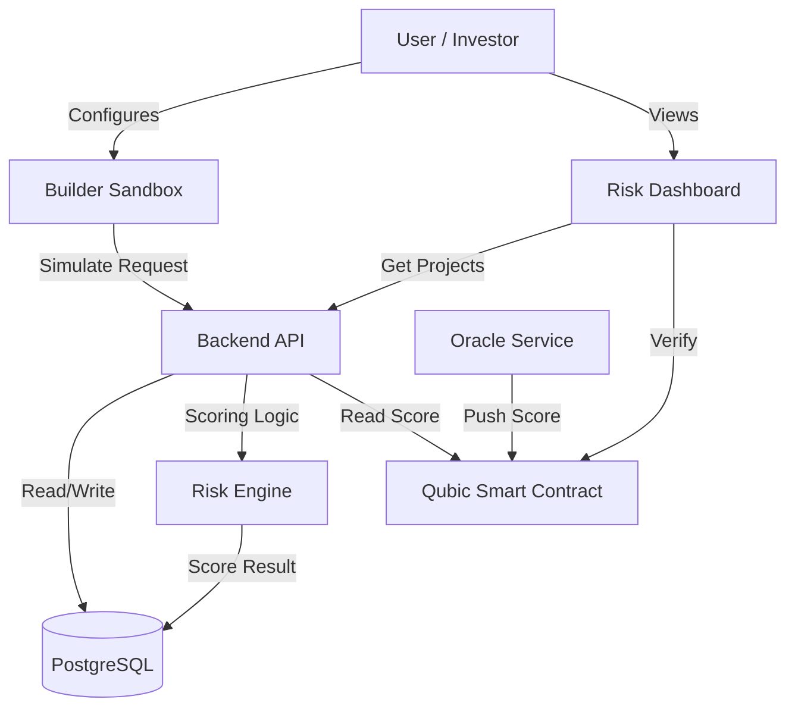

# Nostromo Guardian Architecture

## 🧩 System Overview
Nostromo Guardian is a risk-scoring protocol designed for the Qubic ecosystem. It consists of three main components/tiers:

1. **Frontend (Next.js)**: User interface for project dashboards, analytics, and the builder sandbox.
2. **Backend (Node.js/Express)**: Core scoring engine, REST API, and database management.
3. **Smart Contract (Qubic/C++)**: On-chain storage of verified scores for immutable transparency.

## 🏗 Component Diagram

## 🔄 Data Flow
1. **Simulation**: Users adjust project parameters in the interactive Sandbox.
2. **Scoring**: Backend `ScoringService` computes a risk score (0-100) based on 7 dimensions.
3. **Persistence**: Approved audits are stored in PostgreSQL.
4. **Verification**: Scores are anchored to the Qubic network via Smart Contract transactions (via Mock/Oracle).

## 🛠 Technology Stack
- **Frontend**: Next.js 14, Tailwind CSS, Framer Motion, Recharts.
- **Backend**: Node.js, Express, TypeScript, Zod.
- **Database**: PostgreSQL 16.
- **Blockchain**: Qubic (C++ Smart Contracts).
- **DevOps**: Docker, Render.com.

## 📂 Project Structure
- `/frontend`: Next.js application.
- `/backend`: Express API and services.
- `/contracts`: Qubic Smart Contract (C++).
- `/Dev`: Development logs and artifacts.

## 💾 Database Schema
See [SCHEMA.md](./SCHEMA.md) for detailed Entity-Relationship diagrams.
